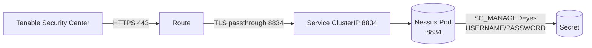

# Managed Nessus Scanner Deployment on Red Hat OpenShift

OpenShift (veya tek-node CRC) üzerinde **SC tarafından yönetilen** bir Nessus
scanner ayağa kaldırma rehberi. İki kurulum modu kapsanır: internet erişimi
olan ortamlar için **online**, hava boşluklu (air-gapped) ortamlar için
**offline**.

!!! info "Hedef mimari"
    - **Pod**: `tenable/nessus:*-ubuntu` image'ı, TCP 8834 dinler
    - **Service**: ClusterIP, pod'a 8834'te erişim
    - **Route**: TLS passthrough — Nessus kendi sertifikasını sunar, OpenShift edge sadece SNI'a göre yönlendirir
    - **SC entegrasyonu**: Tenable Security Center scanner'ı bu route üzerinden ekler ve plugin push'larını yapar



## Önkoşullar

- `oc` CLI, cluster'a `cluster-admin` veya hedef namespace üzerinde yeterli
  yetkiyle login.
- Hedef namespace adına karar verilmiş olması (örnek: `mssp-tenant-acme`).
- Nessus admin kullanıcı adı / parolası (manifest içinden Secret olarak gelir;
  parola en az 14 karakter, harf+rakam+sembol).
- SC tarafında scanner'ı eklemek için yetkili kullanıcı.

## Örnek manifest

Aşağıdaki manifest dosyası repo içinde [`assets/samples/nessus-scanner-deployment.yaml`](https://github.com/yukselao/tenable-wiki/blob/main/assets/samples/nessus-scanner-deployment.yaml) altındadır.
İçinde 5 kaynak bulunur: **Namespace, Secret, Deployment, Service, Route**.

??? example "nessus-scanner-deployment.yaml — tam içerik"

    ```yaml
    --8<-- "assets/samples/nessus-scanner-deployment.yaml"
    ```

!!! warning "Parolayı değiştir"
    Manifest içindeki `PASSWORD` değeri yalnızca örnektir. Cluster'a uygulamadan
    önce mutlaka kendi güvenli parolanla değiştir veya Secret'ı manifest dışında
    yönet (örn. SealedSecret, External Secrets, Vault).

---

## Online Kurulum

İnternet erişimi olan bir cluster'da, Tenable Docker Hub'tan image otomatik
çekilerek yapılan kurulum.

### Grup 1 — Manifest'i uygula

```bash
oc apply -f nessus-scanner-deployment.yaml
```

YAML içindeki 5 kaynak (Namespace, Secret, Deployment, Service, Route)
sırasıyla cluster'a gönderilir. Namespace yoksa oluşturulur, varsa idempotent
olarak güncellenir.

### Grup 2 — İlk durum kontrolü

```bash
oc -n mssp-tenant-acme get pods
oc -n mssp-tenant-acme get events --sort-by='.lastTimestamp' -w
```

Pod'un yaratılıp yaratılmadığını ve scheduler'ın node'a atayıp atamadığını
görürsün. `events -w` watch modunda anlık event akışı sağlar; image pull,
container start ve hata durumlarını canlı izlemek için kullanılır.

### Grup 3 — BackOff teşhisi (kritik adım)

```bash
oc -n mssp-tenant-acme logs -l app=nessus-scanner --tail=50
```

Pod `CrashLoopBackOff` veya `Error` durumundaysa log'lara bakıp gerçek hatayı
tespit edersin. Tipik durum: Tenable image'ının **root UID** istemesi sebebiyle
default `restricted-v2` SCC altında başlayamamasıdır. Çözüm bir sonraki adımda.

### Grup 4 — SCC sorunu çözümü (OpenShift'e özel)

```bash
oc -n mssp-tenant-acme create serviceaccount nessus-sa
oc adm policy add-scc-to-user anyuid -z nessus-sa -n mssp-tenant-acme
oc -n mssp-tenant-acme set serviceaccount deployment/nessus-scanner nessus-sa
```

OpenShift'in default `restricted-v2` SCC'si, container'ları rastgele yüksek
UID'lerle başlatır. Tenable image'ı root (UID 0) ister. Yukarıdaki üç komut
sırasıyla:

1. **Yeni bir ServiceAccount yaratır** (`nessus-sa`).
2. **`anyuid` SCC'sini SA'ya bağlar** — yani SA "kendi UID'imle çalışacağım"
   diyebilir.
3. **Deployment'ı bu SA'yı kullanacak şekilde patch'ler** — bu otomatik olarak
   yeni bir pod tetikler.

!!! danger "SCC tercihi"
    `anyuid` SCC, container'ın kendi seçtiği UID ile çalışmasına izin verir
    (root dahil). Mümkün olduğunda Tenable image'ı non-root UID ile çalışacak
    biçimde yapılandırılmalı; `anyuid` minimum gereksinim olarak kullanılmalıdır.

### Grup 5 — Pod Ready durumunu izle

```bash
oc -n mssp-tenant-acme get pod -l app=nessus-scanner -w
```

`0/1 Running` → `1/1 Running` geçişini bekler. Ready olması Nessus'un
TCP 8834'te dinlemeye başladığı anlamına gelir (manifest'teki `readinessProbe`
TCP socket kontrolü yapar).

### Grup 6 — SC entegrasyon endpoint'ini al

```bash
oc -n mssp-tenant-acme get route nessus-scanner -o jsonpath='{.spec.host}{"\n"}'
```

Aldığın **Route URL**'i SC UI'da scanner ekleme formuna girersin.
**Port 443** olarak verirsin — TLS passthrough sayesinde edge router bağlantıyı
container'ın 8834'üne map'ler. Kimlik doğrulama için manifest'teki Secret içinde
tanımlı kullanıcı adı ve parola kullanılır.

---

## Offline Kurulum

Air-gapped (internet erişimi olmayan) bir CRC veya OpenShift cluster'ında
kurulum. İki şeyi local'e indirip taşıman gerekir:

1. **Container image** → CRC veya OpenShift cluster'ına yüklenecek.
2. **YAML manifest** → zaten elinde (`nessus-scanner-deployment.yaml`).

### Adım 1 — Image'i online ortamda çek ve TAR'a çevir

İnternet erişimi olan bir makinede (Docker veya Podman kuruluysa):

=== "Docker"

    ```bash
    # Image'i pull et
    docker pull tenable/nessus:latest-ubuntu

    # Hangi versiyon olduğunu görmek için
    docker inspect tenable/nessus:latest-ubuntu | grep -i version

    # TAR'a kaydet ve sıkıştır (~500 MB → ~400 MB)
    docker save tenable/nessus:latest-ubuntu | gzip > tenable-nessus-ubuntu.tar.gz
    ```

=== "Podman"

    ```bash
    podman pull tenable/nessus:latest-ubuntu
    podman save -o tenable-nessus-ubuntu.tar tenable/nessus:latest-ubuntu
    gzip tenable-nessus-ubuntu.tar
    ```

Çıktı: `tenable-nessus-ubuntu.tar.gz` (~400 MB). Bu dosyayı offline ortama
(USB, internal repository, vs.) taşı.

!!! tip "Repo'da neden tar.gz yok?"
    GitHub'ın 100 MB dosya boyutu sınırı sebebiyle bu arşiv repo'ya commit
    edilmez (`.gitignore` ile dışarıda tutulur). Yukarıdaki komutla kendi
    makinende üretmen gerekir.

### Adım 2 — Versiyon-pinli tag'i belirle (önemli)

Offline tekrar üretilebilirlik için `latest-ubuntu` yerine **sabit bir tag**
kullan:

```bash
# Online ortamda image digest veya specific version tag'ini öğren
docker images --digests tenable/nessus

# Tenable Docker Hub sayfasından specific version pull et:
docker pull tenable/nessus:10.8.4-ubuntu
docker save tenable/nessus:10.8.4-ubuntu | gzip > tenable-nessus-10.8.4.tar.gz
```

Versiyon-pinli tag offline'da kararlı bir kurulum sağlar — Tenable yeni versiyon
push ettiğinde mevcut deployment'ın bozulmaz.

### Adım 3 — Offline ortamda image'i CRC içine yükle

CRC tek-node OpenShift olduğu için image'i CRC VM'inin CRI-O storage'ına
yüklemen gerekir.

=== "Yöntem A — Doğrudan CRC içine kopyala (en basit)"

    ```bash
    # TAR'ı CRC VM'ine kopyala
    crc cp tenable-nessus-ubuntu.tar.gz /tmp/

    # CRC içinde podman load (CRC podman ve crictl ile uyumlu)
    crc ssh -- "sudo podman load -i /tmp/tenable-nessus-ubuntu.tar.gz"

    # Doğrulama
    crc ssh -- "sudo crictl images | grep tenable"
    ```

=== "Yöntem B — Internal Registry'ye push"

    OpenShift'in entegre image registry'si varsa daha kalıcı çözüm:

    ```bash
    # Internal registry'yi expose et
    oc patch configs.imageregistry.operator.openshift.io/cluster \
      --type merge -p '{"spec":{"defaultRoute":true}}'

    # Registry route'unu öğren
    REGISTRY=$(oc get route default-route -n openshift-image-registry \
      -o jsonpath='{.spec.host}')

    # Login
    docker login -u $(oc whoami) -p $(oc whoami -t) $REGISTRY

    # Image'i tag'le ve push et
    docker load -i tenable-nessus-ubuntu.tar.gz
    docker tag tenable/nessus:latest-ubuntu \
      $REGISTRY/mssp-tenant-acme/nessus:latest-ubuntu
    docker push $REGISTRY/mssp-tenant-acme/nessus:latest-ubuntu
    ```

### Adım 4 — Manifest'i offline image'i kullanacak şekilde güncelle

`nessus-scanner-deployment.yaml` içindeki Deployment kısmında **image referansı**
ve **pull policy**'yi değiştir.

=== "Yöntem A için"

    ```yaml
    spec:
      template:
        spec:
          containers:
            - name: nessus
              image: tenable/nessus:latest-ubuntu      # aynı kalabilir
              imagePullPolicy: IfNotPresent             # Always'tan IfNotPresent'a
    ```

=== "Yöntem B için"

    ```yaml
    spec:
      template:
        spec:
          containers:
            - name: nessus
              image: image-registry.openshift-image-registry.svc:5000/mssp-tenant-acme/nessus:latest-ubuntu
              imagePullPolicy: IfNotPresent
    ```

!!! danger "imagePullPolicy: IfNotPresent kritik"
    `Always` olursa Kubernetes registry'den pull'a kalkar ve offline ortamda
    başarısız olur. `IfNotPresent` ise local'de varsa kullanır, yoksa pull
    dener. Air-gapped ortamda **mutlaka** `IfNotPresent`.

### Adım 5 — Offline deploy

```bash
# Image local'de mi kontrol et
crc ssh -- "sudo crictl images | grep tenable"

# Deploy
oc apply -f nessus-scanner-deployment.yaml

# SCC'yi tekrar uygula (her ortamda tekrar gerekli)
oc -n mssp-tenant-acme create serviceaccount nessus-sa
oc adm policy add-scc-to-user anyuid -z nessus-sa -n mssp-tenant-acme
oc -n mssp-tenant-acme set serviceaccount deployment/nessus-scanner nessus-sa

# Pod izle
oc -n mssp-tenant-acme get pod -l app=nessus-scanner -w
```

### Adım 6 — Otomasyon scripti (tekrar edilebilir offline kurulum)

```bash
#!/bin/bash
# offline-deploy.sh — fully offline Nessus scanner deployment
set -euo pipefail

NAMESPACE="${1:-mssp-tenant-acme}"
IMAGE_TAR="${2:-./tenable-nessus-ubuntu.tar.gz}"

# 1. Image'i CRC'ye yükle (idempotent)
echo "[1/4] Loading image into CRC..."
crc cp "$IMAGE_TAR" /tmp/nessus-image.tar.gz
crc ssh -- "sudo podman load -i /tmp/nessus-image.tar.gz"

# 2. Manifest'i uygula
echo "[2/4] Applying manifests..."
oc apply -f nessus-scanner-deployment.yaml

# 3. SCC bind
echo "[3/4] Binding anyuid SCC..."
oc -n "$NAMESPACE" create serviceaccount nessus-sa --dry-run=client -o yaml | oc apply -f -
oc adm policy add-scc-to-user anyuid -z nessus-sa -n "$NAMESPACE"
oc -n "$NAMESPACE" set serviceaccount deployment/nessus-scanner nessus-sa

# 4. Hazır olana kadar bekle
echo "[4/4] Waiting for pod to be Ready..."
oc -n "$NAMESPACE" wait --for=condition=Ready pod -l app=nessus-scanner --timeout=300s

# Endpoint'i göster
echo ""
echo "Scanner is ready. Route URL:"
oc -n "$NAMESPACE" get route nessus-scanner -o jsonpath='{.spec.host}{"\n"}'
```

Kullanım:

```bash
chmod +x offline-deploy.sh
./offline-deploy.sh mssp-tenant-acme tenable-nessus-ubuntu.tar.gz
```

---

## Online vs Offline — Karşılaştırma

| Adım                | Online                            | Offline                                                              |
| ------------------- | --------------------------------- | -------------------------------------------------------------------- |
| Image kaynağı       | Docker Hub (otomatik pull)        | Local TAR → `podman load` veya internal registry push                |
| `imagePullPolicy`   | `Always`                          | `IfNotPresent` **(kritik)**                                          |
| Image tag           | `latest-ubuntu` (kabul edilebilir) | Versiyon-pinli (örn. `10.8.4-ubuntu`) — reproducibility şartı        |
| Plugin update       | İnternet üzerinden otomatik        | SC üzerinden push veya offline plugin paketi                         |
| Tipik kurulum süresi | ~5 dk (image pull dahil)          | ~1 dk (image local'de)                                               |

## Notlar

### Plugin güncellemeleri

Bu kurulum **SC-managed** (Security Center tarafından yönetilen) bir
scanner'dır. Plugin'ler scanner'a doğrudan internetten gelmez; SC bunları
push'lar.

- **SC'nin kendisi online ise**: SC plugin'leri internetten alır ve
  scanner'lara push'lar — ek bir şey yapmana gerek yok.
- **SC de offline ise**: SC üzerinde **offline plugin update** mekanizmasını
  kurman gerekir — `plugins.nessus.org` yerine local plugin feed kullanılır.
  Bu, SC tarafının dökümantasyonu kapsamına girer.

### Replica sayısı neden 1?

Manifest'te `replicas: 1` ve `strategy: Recreate` kullanılır. Sebep: her
scanner'ın SC'de **ayrı bir kimliği** vardır. İki replica çalıştırırsan iki
ayrı pod aynı kimlikle SC'ye bağlanmaya çalışır ve kimlik çakışması olur.
Yatay ölçek için **birden fazla scanner deployment'ı** (farklı namespace
veya farklı isim) kullanılır.

### Stateless tasarım

Manifest'te volume mount yoktur. Pod yeniden başladığında plugin'ler SC
tarafından tekrar push'lanır. Bu, scanner'ı tamamen ephemeral yapar — node
failure veya rolling redeploy durumunda sorun yaratmaz.

---

## Kaldırma (Uninstallation)

Test kurulumunu sonlandırırken hem **namespace içindeki kaynakları** hem de
kurulum sırasında oluşturulan **cluster-scoped bağlamayı** (SCC binding) ve
varsa **offline image kalıntısını** temizlemen gerekir. Aşağıdaki sıra,
kalıntı bırakmadan tam temizlik için en güvenli akıştır.

!!! warning "Geri alınamaz"
    Bu işlemler scanner'ı ve içindeki tüm yapılandırmayı (kullanıcı, secret,
    route, kayıtlı SC ilişkisi) silmiştir. SC tarafında scanner kaydını da
    elle çıkarman gerekir — aksi halde SC'de "offline scanner" olarak öksüz
    bir kayıt kalır.

### 1. Önce SC tarafında scanner'ı sil

OpenShift'ten silmeden **önce** SC UI'da
**Resources → Scanners → (kaldırılacak scanner) → Delete** adımını uygula.
Önce SC'den silmek, scanner'ın "unable to connect" alarmı üretmesini engeller.

### 2. Mevcut kaynakları listele (sanity check)

```bash
oc -n mssp-tenant-acme get all,routes,secrets,sa
```

Beklenen liste: `deployment/nessus-scanner`, `service/nessus-scanner`,
`route/nessus-scanner`, `secret/nessus-credentials`, `sa/nessus-sa`,
`sa/default` (otomatik), `sa/builder`, `sa/deployer`.

### 3. SCC bağlamasını kaldır (cluster-scoped)

```bash
oc adm policy remove-scc-from-user anyuid -z nessus-sa -n mssp-tenant-acme
```

`anyuid` SCC cluster-scoped'tur — namespace silindiğinde RoleBinding
otomatik gitse de bu komut, başka bir namespace'te aynı isimle SA
yaratırsan eski binding'in dönüp dönmediği gibi sürpriz durumların önüne
geçer. Açık temizlik tercih edilir.

### 4. Manifest'le yaratılan kaynakları sil

İki seçenek var; eşdeğer sonuç verir, durumuna göre seç:

=== "A — Manifest tersine al (önerilen)"

    ```bash
    oc delete -f nessus-scanner-deployment.yaml
    ```

    `oc apply -f`'ın simetriği. Yalnızca manifest'te tanımlı 5 kaynak
    (Namespace, Secret, Deployment, Service, Route) silinir; namespace
    içine sonradan elle eklediğin başka bir şey varsa **dokunulmaz**.

=== "B — Namespace'i komple sil (broad)"

    ```bash
    oc delete namespace mssp-tenant-acme
    ```

    Namespace silindiğinde içindeki **her şey** (manifest'tekiler +
    `nessus-sa` ServiceAccount'u + sonradan eklenmiş ne varsa) garbage
    collect edilir. Tek-tenant test ortamlarında en pratik yol budur.

!!! tip "Hangi yöntem ne zaman?"
    - **Test / lab**: Yöntem B (`delete namespace`) — tek komut, kalıntı yok.
    - **Production / paylaşılan namespace**: Yöntem A (`delete -f`) — sadece
      kendi yarattığın kaynakları silersin, namespace'teki diğer iş
      yüklerine dokunmazsın.

### 5. ServiceAccount'u temizle (yalnızca Yöntem A kullandıysan)

`nessus-sa` ServiceAccount'u manifest dışında elle yaratıldığı için
`oc delete -f` kapsamına girmez. Yöntem B'yi seçtiysen namespace ile birlikte
zaten silinmiştir; Yöntem A'yı seçtiysen ek olarak şunu çalıştır:

```bash
oc -n mssp-tenant-acme delete serviceaccount nessus-sa
```

### 6. Offline image temizliği (yalnızca offline kurulum yaptıysan)

Online kurulumda image registry cache'i otomatik yönetilir; ek temizlik
gerekmez. Offline (CRC veya internal registry) ortamlar için:

=== "Yöntem A — CRC içine yüklenmişse"

    ```bash
    crc ssh -- "sudo crictl images | grep tenable"
    crc ssh -- "sudo crictl rmi tenable/nessus:latest-ubuntu"
    ```

=== "Yöntem B — Internal registry'ye push edilmişse"

    Image'ın yaşadığı namespace silindiyse ImageStream da otomatik silinmiş
    olur. Farklı namespace'teyse:

    ```bash
    oc -n <registry-namespace> delete imagestream nessus
    ```

### 7. Doğrulama

```bash
# Namespace artık olmamalı (Yöntem B kullanıldıysa)
oc get namespace mssp-tenant-acme
# Beklenen: Error from server (NotFound)

# SCC binding artık nessus-sa içermemeli
oc get scc anyuid -o yaml | grep -A2 'users:'
# Beklenen: nessus-sa satırı yok

# Route artık çözümlenmemeli
curl -k https://<eski-route-url>:443/
# Beklenen: connection refused / 503
```

Bu üç çıktı temizse kurulum tamamen geri alınmıştır ve aynı isimle yeniden
kurulum yapabilirsin.
