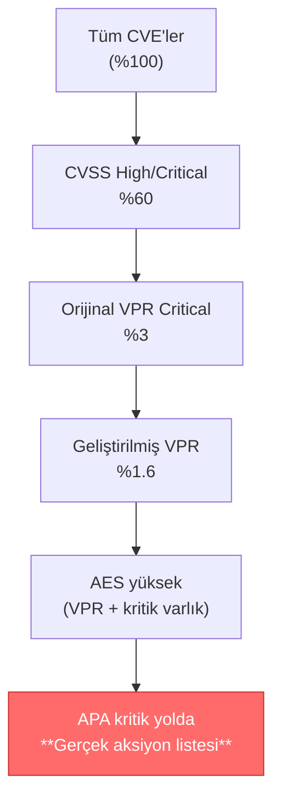

# Akıllı Önceliklendirme: VPR, ACR ve AES Skorlarının Birlikte Çalışma Matematiği

!!! abstract "Bu yazıda ne var?"
    Tenable'ın üçlü skorlama mekanizması — **VPR** (dinamik tehdit skoru), **ACR** (varlık iş kritikliği) ve **AES** (toplam maruziyet skoru) — birbirini nasıl besler, gürültüyü nasıl süzer ve "önce hangi zafiyeti yamayalım?" sorusunu nasıl matematiksel olarak yanıtlar? Pratik senaryolarla, sayısal örneklerle, **2026 itibarıyla** geçerli güncel modelle anlatıyoruz. Bonus olarak: **Attack Path Analysis (APA)** ile önceliklendirmenin devrim niteliğinde ileri taşınması ve AI çağında defansif tarafın **Tenable One Exposure Management** ile nasıl üstünlük kazanacağı.

---

## 1. Neden "Önceliklendirme" Bir Tercih Değil, Zorunluluk?

Modern kurumsal ortamlarda zafiyet yönetiminin en zor sorusu **"hangisinden başlayalım?"** sorusudur. Çünkü ham veri, neredeyse kullanılamaz hâldedir:

!!! danger "Çıplak gerçek"
    **CVSS, CVE'lerin yaklaşık %60'ını "High" veya "Critical" olarak işaretler.** Tenable'ın milyonlarca varlık üzerindeki gözlemine göre orijinal VPR bu oranı **%3'e**, **2025 sonunda yayımlanan ve 1 Temmuz 2026'da platform genelinde standart hâline gelen geliştirilmiş VPR ise yalnızca %1.6'ya** indirir.

Bu farkı somutlaştırmak için bir örnek:

!!! example "10.000 CVE'lik bir kurumsal envanter"
    | Yaklaşım | "Kritik" sayılan CVE | İnsan-saat (CVE başına 30 dk) |
    | --- | --- | --- |
    | Yalnızca CVSS | 6.000 | 3.000 saat (~ 1.5 yıl, 1 mühendis) |
    | Orijinal VPR | 300 | 150 saat (~ 4 hafta) |
    | Geliştirilmiş VPR | 160 | 80 saat (~ 2 hafta) |

Bir SOC ekibinin yıllık efor bütçesi bellidir. **Doğru önceliklendirme yapmadan**, yamalama listesi mühendislerin değil, **şansın** sıralaması olur. Kurumsal yapılarda — finans, enerji, kamu, savunma sanayi gibi — bu **kabul edilemez** bir tercihtir. Risk, yamalanmamış bir kritik varlığa düştüğünde, "300 önümüzde 50.000 satır vardı" mazeret olmaz.

> Önceliklendirme, kurumsal güvenlikte **lüks değil, hijyendir**. Hijyen olmayan yerde tarama, yama ve uyumluluk denetimi de değer üretmez.

---

## 2. Üçlü Skorlama: Birbirini Tamamlayan Üç Mercek

Tenable, "kritik mi değil mi?" sorusunu üç ayrı mercekten geçirir. Her bir mercek farklı bir soruyu yanıtlar:

| Skor | Sorusu | Üretildiği Yer | Ölçek |
| --- | --- | --- | --- |
| **VPR** | _Bu zafiyet **gerçekten** sömürülüyor mu, sömürülecek mi?_ | Zafiyet (CVE) seviyesinde | 0.1 – 10.0 |
| **ACR** | _Bu varlık iş açısından **ne kadar değerli**?_ | Varlık seviyesinde | 1 – 10 |
| **AES** | _Bu varlığın **toplam maruziyeti** ne durumda?_ | Varlık seviyesinde | 0 – 1000 |

!!! tip "Akılda kalıcı analoji"
    - **VPR** zafiyetin "**ateş**i"dir (yangın ne kadar büyük?).
    - **ACR** varlığın "**servet**i"dir (yanan binada ne var?).
    - **AES** ise "**hangi binayı önce söndürelim?**" listesidir.

Aşağıda her birini ayrıntılı inceleyelim.

---

## 3. VPR — Vulnerability Priority Rating (Dinamik Tehdit Skoru)

VPR, Tenable'ın **2019'da patentlediği** ve **2025–2026'da makine öğrenmesi modelini önemli ölçüde geliştirdiği** dinamik bir risk skorudur. Statik bir CVSS skoru gibi davranmaz; **her gün** güncellenir, çünkü tehdit ortamı her gün değişir.

### 3.1 VPR Neyden Beslenir?

!!! info "VPR v2 veri kaynakları"
    Geliştirilmiş VPR (v2), aşağıdaki kaynakları aynı anda işler:

    - **NVD** (National Vulnerability Database)
    - **CVSS** (etki skoru bileşeni olarak)
    - **Tenable Vulnerability Intelligence**
    - **Tenable Research Special Operations (RSO)** ekibinin özel araştırma çıktıları
    - **Açık ve özel exploit veritabanları**
    - **Curated web makaleleri** ve **AI haber özellikleri**
    - **CISA** uyarıları (KEV katalogu dahil)
    - **GitHub** (PoC kodları, exploit repo'ları)
    - **Mastodon** (güvenlik araştırmacılarının erken sinyalleri)

### 3.2 VPR Nasıl Hesaplanır?

VPR iki bileşenin **eşit ağırlıklı** kombinasyonudur (orijinal VPR'den önemli bir fark — orijinalde etki skoru daha ağırlıklıydı):

```
VPR = f( Threat Score , Impact Score )
        ↑                ↑
        ML modeli       CVSS impact
        sömürü olasılığı tahmini
```

**Threat Score**, makine öğrenmesi modelinin ürettiği **yakın vadeli sömürü olasılığı** tahminidir. Modelin girdileri:

- Tehdit aktörü etkinliği
- Exploit kod olgunluğu (PoC mı, weaponized mi?)
- Zafiyetin yaşı
- AI ile etiketlenmiş bağlam: "**ransomware tarafından hedef alınıyor**", "**vahşi doğada sömürülüyor**", "**zero-day**"

!!! note "Generative AI'nin VPR'deki rolü"
    Tenable, küratör süzgecinden geçmiş web makalelerini **generatif AI** ile ölçekli olarak işler ve her CVE'ye:

    - **Threat Summary** (zafiyetin özeti, geçmişte hangi tehdit aktörlerinin hedef aldığı)
    - **Remediation Summary** (giderme adımları)
    - **Hedef bölgeler** (örn. "Avrupa", "Kuzey Amerika")
    - **Hedef sektörler** (örn. "finans", "sağlık")

    gibi **bağlamsal metadata** ekler. Bu metadata skoru doğrudan etkilemese de, analiste **"bu bana neden önemli?"** sorusunun cevabını verir.

### 3.3 VPR Severity Bantları

| Bant | Skor | Anlamı |
| --- | --- | --- |
| **Critical** | 9.0 – 10.0 | Aktif kampanyalar, weaponized exploitler gözlemleniyor — **bugün** harekete geç |
| **High** | 7.0 – 8.9 | Yüksek sömürü riski, yakın vadeli aksiyon |
| **Medium** | 4.0 – 6.9 | Orta düzey risk, planlı yamalama |
| **Low** | 0.1 – 3.9 | Bilinen sömürü yok ya da çok zayıf |

!!! warning "'Exploitable' ile 'Exploited' aynı şey değildir"
    - **Exploitable**: Bir exploit mevcut — bu, halka açık bir arşivde **güvenilir olmayan bir PoC** kadar zayıf da olabilir.
    - **Exploited**: Bir saldırı **gerçekleşmiş**, zafiyet **ihlal edilmiş**.

    VPR bu farkı modellemekte ustadır; salt "exploit var" diye yüksek skor vermez.

### 3.4 VPR'nin CVSS ve EPSS'ten Farkı

!!! quote "Üç farklı skor, üç farklı amaç"
    - **CVSS**: Teknik şiddet (zafiyetin yapısal kötülüğü). Statik.
    - **EPSS**: İstatistiksel sömürü olasılığı. Genel evren üzerinden.
    - **VPR**: Operasyonel önceliklendirme — gerçek dünya tehdit verisi + iş etkisi. Dinamik.

    VPR; CVSS ve EPSS'i **ikame etmez, tamamlar**. Tenable'ın resmi tutumu da budur.

### 3.5 1 Temmuz 2026 Geçişi — Bilinmesi Gerekenler

!!! danger "API kullananlar dikkat"
    1 Temmuz 2026 itibarıyla:

    - **VPR (Beta)** etiketi kalkıyor; geliştirilmiş model **birincil VPR** olarak standartlaşıyor.
    - Eski (legacy) VPR v1 **emekli** ediliyor.
    - API tarafında `vpr_v2_score` filtre parametresi ve `plugin.vpr_v2` response property **deprecate** ediliyor. Mevcut entegrasyonlar `vpr_score` ve `plugin.vpr` alanlarını kullanmaya geçirilmeli — çünkü bu alanlar **otomatik olarak yeni modele dönecek**.
    - Etkilenen endpoint'ler: `Export vulnerabilities`, `Web App Scanning – Export findings`, `Download vulnerabilities chunk`, `Download findings export chunk`.

    Çoğu kullanıcı için arka planda eşleme yapıldığından **manuel iş yoktur**, ama özel script'ler ve SOAR playbook'ları gözden geçirilmelidir.

---

## 4. ACR — Asset Criticality Rating (Varlık İş Kritikliği)

Aynı CVE, bir test sunucusunda da, tüm finansal işlemlerinizin geçtiği bir Oracle DB'de de bulunabilir. **Aynı VPR**, **aynı yamalama önceliği** anlamına gelmez. İşte tam bu noktada **ACR** devreye girer.

### 4.1 ACR Ne Ölçer?

ACR, bir varlığın **işletme açısından kritikliğini** **1–10 skalasında** ölçer:

- **Varlığın türü ve fonksiyonu** (DB, AD DC, kullanıcı laptop'ı, IoT cihazı, OT PLC...)
- **Maruz kaldığı çevre** (internet'e açık mı, segmente mi?)
- **Üzerindeki veri / hizmet** kritikliği
- **Kimlik ve yetki bağlamı** (privileged hesap mı çalıştırıyor?)

### 4.2 Geliştirilmiş Asset Classification Engine

!!! tip "2026 güncellemesi"
    1 Temmuz 2026 tarihinde Tenable, ACR'yi besleyen **asset classification engine**'i de güçlendirdi. Yeni motor:

    - **Cloud**, **OT** ve **üçüncü parti** kaynaklardan gelen varlıkları daha doğru sınıflandırır.
    - Bir varlığın **fonksiyonunu** (örn. "domain controller", "code repository", "PLC", "container registry") otomatik tespit eder.
    - Müşteri **manuel müdahale yapmadan**, dashboard'larında daha doğru ACR değerleri görür.

### 4.3 ACR Override

ACR otomatik üretilir, ancak **iş bilgisini** sadece kurumun kendisi tam bilebilir. Tenable bu nedenle **manuel ACR override** imkânı sunar:

```yaml
# Pratik kural seti (örnek)
- match: tag == "PCI-Scope"
  set_acr: 9
- match: tag == "Production-DB" AND function == "Database"
  set_acr: 10
- match: hostname matches "test-*"
  set_acr: 3
```

Bu, **iş ve güvenlik konuşmalarını aynı dilde yapan** belki de en kritik araçtır.

---

## 5. AES — Asset Exposure Score (Toplam Maruziyet Skoru)

AES, bir varlığın **VPR ve ACR'sinin birleşik fotoğrafıdır**. Skala **0–1000** arasındadır ve **varlık başına** üretilir.

### 5.1 AES'in Anlamı

!!! info "AES = \"Bu varlık şu anda ne kadar 'açık'?\""
    - **Yüksek AES** (≈ 700–1000) = Yüksek VPR'lı zafiyetleri **olan** + iş açısından **kritik** varlık → **derhal**.
    - **Orta AES** (≈ 400–700) = Karışık tablo. Ya çok kritik ama az zafiyetli, ya az kritik ama çok zafiyetli.
    - **Düşük AES** (≈ 0–400) = Yamalama kuyruğunun arkasına alınabilir.

### 5.2 AES'in VPR ve ACR ile İlişkisi

VPR ve ACR, AES'in (ve kurum genelindeki **CES — Cyber Exposure Score**'un) **doğrudan girdileridir**. Yani:

```
                ┌─────────────┐
                │     CES     │  ← Kurumun bütüncül siber maruziyet skoru
                │ (kurum geneli)│
                └──────▲──────┘
                       │ ortalama / ağırlıklı toplam
       ┌───────────────┴───────────────┐
       │                               │
┌──────┴──────┐                 ┌──────┴──────┐
│     AES     │                 │     AES     │  ... (her varlık için)
│ (varlık 1)  │                 │ (varlık N)  │
└──────▲──────┘                 └──────▲──────┘
       │                               │
   ┌───┴────┐                      ┌───┴────┐
   │  VPR   │  + ACR               │  VPR   │  + ACR
   │ (CVE 1)│                      │ (CVE k)│
   └────────┘                      └────────┘
```

!!! warning "1 Temmuz 2026 etkisi"
    Geliştirilmiş VPR ve geliştirilmiş asset classification engine, **AES ve CES'e doğrudan girdi** olduklarından, müşteriler **manuel hiçbir şey yapmadan** o tarih itibarıyla daha doğru AES/CES değerleri göreceklerdir. Bu, **gerçeği daha iyi yansıtan bir maruziyet tablosu** demektir — bazı varlıkların skoru artabilir, bazıları azalabilir.

---

## 6. Üçlünün Matematiği — Pratik Önceliklendirme Senaryoları

Şimdi en sevdiğimiz kısma geldik: **gerçek dünya örnekleri**.

### Senaryo A: "Tehlikeli ama önemsiz"

!!! example "DC-LAB-07 — Geliştirici test makinesi"
    - **CVE-202X-9999** üzerinde aktif, **VPR = 9.6**
    - **ACR = 2** (test makinesi, üretim verisi yok, segmente)
    - **AES ≈ 350** (hesaplanmış)

    **Karar:** Yüksek VPR aldatmasın. Bu varlık **bu hafta** yamalanması gerekmiyor. Sıralı kuyruğa alınır, **APA ile bir saldırı yolu üzerinde değilse** bekletilebilir.

### Senaryo B: "Sessiz ama hayati"

!!! example "FIN-DB-01 — Üretim finans veritabanı"
    - **CVE-202X-1234**, **VPR = 6.2** (orta)
    - **ACR = 10** (PCI scope, üretim, kritik veri)
    - **AES ≈ 720**

    **Karar:** VPR yüksek değil ama varlık o kadar değerli ki orta seviye bir zafiyet bile ciddi maruziyet yaratıyor. **Bu hafta yamalanır**, kompanzatör kontroller (network segmentation, WAF rule) hemen sıkılaştırılır.

### Senaryo C: "Yangın alarmı"

!!! danger "AD-DC-02 — Active Directory Domain Controller"
    - **CVE-202X-5678**, **VPR = 9.8** (vahşi doğada sömürülüyor, ransomware kullanıyor)
    - **ACR = 10**
    - **AES = 970**

    **Karar:** Acil müdahale. Mümkünse **24 saat içinde**. Yamalama mümkün değilse: izolasyon, EDR kuralı, ek loglama, kompanzatör kontroller. **APA ile bu varlıktan başlayan tüm saldırı yolları** anında haritalandırılır.

### Senaryo D: "Görünmez tehlike"

!!! example "ENG-WORKSTATION-44 — Bir mühendisin laptop'u"
    - **CVE-202X-7777**, **VPR = 5.5** (orta)
    - **ACR = 4** (kullanıcı makinesi)
    - **AES ≈ 410**

    Tek başına bakıldığında: orta öncelik. **Ancak** APA bu makineyi **AD-DC-02'ye giden bir saldırı yolu üzerinde** gösterirse, bu CVE **etkili VPR'ı 9'a yakın** bir varlıkmış gibi davranılması gerekir. → **APA, üçlüye eklenen 4. boyuttur.**

### Karar Matrisi (Yamalama SLA Önerisi)

| AES Bandı | Önerilen Aksiyon Süresi |
| --- | --- |
| 850 – 1000 | **24 saat içinde** acil müdahale |
| 700 – 849 | **7 gün** içinde yamalama |
| 500 – 699 | **30 gün** içinde planlı yamalama |
| 300 – 499 | **90 gün** SLA, batch yamalama |
| 0 – 299 | Risk kabulü veya yıllık döngü |

!!! tip "SLA ölçümleriniz de değişecek"
    Tenable'ın **1 Temmuz 2026 duyurusunda** açıkça belirttiği gibi: VPR daha hassas hâle geldiğinden, **VPR-tabanlı SLA istatistikleriniz ve remediation tracking metrikleriniz**, "**gerçekten yüksek riskli**" zafiyetleri yansıtacak şekilde değişecek. Yöneticilere bu beklenti yönetimini yapmak SOC'un işi.

---

## 7. Gürültü Filtreleme: %60'tan %1.6'ya Yolculuk

Önceliklendirmenin sonuçlarını bir piramit gibi düşünelim:



!!! quote "Ne kazandık?"
    10.000 CVE'lik bir envanterde:

    - CVSS sizi 6.000 öğeyle yorar.
    - VPR v2 sizi 160 öğeye odaklar.
    - **AES + APA**, bu 160'tan **gerçek anlamda iş riski oluşturan ~20–40'a** indirir.

    Bu, SOC ekibinin **stratejik dikkat bütçesini** 150 kat verimli kullanması demektir.

---

## 8. Tenable Security Center Plus ile Entegre Kullanım

!!! info "Lisans bağlamı"
    **VPR**, **ACR** ve **AES** üçlüsünün entegre kullanımı **Tenable Security Center Plus** lisansıyla mümkündür. Klasik Security Center üzerinde yalnızca temel CVSS + bazı bağlamsal sınıflandırmalar bulunurken, **Plus paketi**:

    - VPR'ın tam veri kaynağıyla beslenmesini,
    - ACR override ve enhanced classification engine'i,
    - AES'in dashboard, rapor ve API'larda canlı görünmesini,

    sağlar. Tenable One Exposure Management Platform müşterileri ise bu üçlüye ek olarak **Attack Path Analysis** ve **Identity Exposure** verisini de aynı skora dahil edebilir.

> **Pratik öneri:** Tenable.sc kullanıyorsanız ve hâlâ "yalnızca CVSS bantları" üzerinden SLA yönetiyorsanız — Plus geçişini değerlendirmek için somut bir gerekçeniz var: orta-büyük envanterlerde bu üçlü, yamalama efor maliyetinizi ölçülebilir biçimde düşürür.

---

## 9. Devrim Niteliğinde Bir Yetenek: Attack Path Analysis (APA)

VPR + ACR + AES, "**hangi varlıkta hangi zafiyet?**" sorusuna en iyi cevabı verir. Ama saldırganlar varlıklara izole bakmaz — **rotalara** bakar. İşte tam burada **Attack Path Analysis** üçlünün üzerine **devrim niteliğinde** bir boyut ekler.

### 9.1 APA Ne Yapar?

[Tenable Attack Path Analysis](https://www.tenable.com/cybersecurity-guide/learn/attack-path-analysis-apa), saldırganın bakış açısını grafiksel bir model üzerine oturtur:

- **Varlıklar**, **kimlikler** ve **riskler** arasındaki ilişkileri **graf** olarak çıkarır.
- Bir saldırganın **giriş noktasından kritik varlığa** ulaşmak için izleyebileceği **adım sıralarını** gösterir.
- "Toxic combination"ları (zafiyet + zayıf kimlik + yanlış yapılandırma) keşfeder.
- **Choke point**'leri belirler: **bir tek değişiklikle birden çok saldırı yolunu birden kapatabileceğiniz** kavşaklar.

### 9.2 APA, MITRE ATT&CK ile Konuşur

APA salt teorik bir grafik değildir. Her bir kenarı, **MITRE ATT&CK** taktik ve tekniğine eşlenir:

- **Initial Access** → web uygulamasındaki bir CVE
- **Credential Access** → Kerberoasting'e açık servis hesabı
- **Lateral Movement** → SMB relay'e açık paylaşım
- **Privilege Escalation** → DCSync hakkı verilmiş bir kullanıcı
- **Impact** → ransomware drop

Bu eşleme, **teorik tehdit modelleme** ile **uygulamalı güvenlik aksiyonu** arasındaki köprüdür.

### 9.3 APA + VPR/ACR/AES = Önceliklendirmede Yeni Boyut

!!! tip "Neden devrim?"
    Geleneksel önceliklendirme **"varlık merkezli"**dir. APA buna **"yol merkezli"** boyutu ekler:

    - Düşük AES'li bir varlık bile, **kritik varlığa giden tek yolun üzerindeyse**, etkili önceliği zıplar.
    - Yüksek AES'li bir varlık, **hiçbir saldırı yoluyla bağlantılı değilse** (gerçek hayatta nadiren olur ama olur), bekleyebilir.
    - **Choke point** kavramı, kurumlara **"bu tek yamayı yapın, 14 saldırı yolu birden kapanır"** gibi ölçülebilir kararlar sunar.

### 9.4 Pratik APA Örneği

!!! example "Choke point keşfi"
    Bir senaryoda APA şu çıkarımı yapar:

    > **DEV-WORKSTATION-12** üzerindeki **CVE-202X-2222** (VPR=6.1, ACR=4, AES=420) yamalanırsa:
    > - **CFO laptop'una** 3 yol kapanır.
    > - **HR-DB-03**'e 2 yol kapanır.
    > - **AD Tier 0**'a 1 yol kapanır.

    Tek başına AES=420 olan bir varlık, **6 kritik saldırı yolunu kıran tek müdahale** olduğu için listede en üste fırlar. **APA olmadan bu içgörüyü asla göremezsiniz.**

---

## 10. AI Çağında Asimetri: Saldırgan vs. Defansif Ekipler

Ofansif tarafta yapay zekânın kullanımı son iki yılda patladı:

- **LLM destekli reconnaissance** ve OSINT
- **Otomatik exploit chain üretimi**
- **Phishing içeriklerinin** dakikalar içinde bireyselleştirilmesi
- **Polimorfik malware** ve **AI tabanlı evasion**

Bu, defansif ekiplere **eşitsiz bir savaş** dayatır. **Bir saldırgan AI ile dakikada üretiyor, biri tek tek elle inceleyemez.**

!!! quote "Asimetriyi tersine çeviren tek yol: defansta da AI"
    Tenable One Exposure Management Platform, defansif ekiplere AI asimetrisini **kendi lehlerine çevirme** imkânı sunar:

    - **Generatif AI**, VPR içinde web makalelerini ölçekli işler ve bir analistin haftalarca yapacağı bağlam çıkarımını dakikalara indirir.
    - **Tüm exposure verisinin tek platformda toplanması** (zafiyet + kimlik + bulut + OT + saldırı yolları), AI'nın anlamlı sinyaller çıkarması için **hammadde bütünlüğü** sağlar.
    - **APA'nın grafik tabanlı analizi**, milyonlarca olası saldırı kombinasyonunu pratik aksiyon listelerine indirger.
    - **ExposureAI** ile doğal dilde sorgular ("son 7 günde Domain Admin'e giden yeni saldırı yolları?") yanıtlanır.

> **Sonuç:** AI, ofansif tarafta bir tehdit silahıdır; **Tenable One ile defansif tarafta bir asimetri kırıcıdır.** Bunu kullanmayan kurum, AI çağında **iki kat dezavantajlı** mücadele eder: hem rakibin AI'si var, hem kendisinin yok.

---

## 11. Özet — Pratik Aksiyon Listesi

!!! abstract "Bu yazıdan çıkarmanız gereken 10 madde"
    1. **CVSS tek başına önceliklendirme aracı değildir** — kurumsal ortamda gürültüden başka bir şey üretmez.
    2. **VPR**, dinamik tehdit skorunuzdur ve **2026'dan itibaren v2 modeliyle %1.6'lık gerçek risk havuzunu** size verir.
    3. **ACR**, varlığın iş kritikliğini söyler — **iş ve güvenlik konuşmasını ortak dile** çevirir.
    4. **AES**, varlık bazında **VPR + ACR + diğer maruziyet faktörlerini** birleştiren operasyonel skordur.
    5. **CES**, kurum genelindeki bütüncül skordur ve yönetim raporlarınızın gösterge paneli olur.
    6. **VPR ve ACR, AES'in girdisidir.** 1 Temmuz 2026'da arka planda iyileştiklerinde **AES/CES kendiliğinden hassaslaşır**.
    7. **Tenable Security Center Plus** ile bu üçlüyü tam entegre kullanabilirsiniz.
    8. **APA**, varlık merkezli önceliklendirmeye **yol merkezli** boyut ekler — choke point kararları üretmenizi sağlar.
    9. **APA + üçlü skorlama** kombinasyonu, modern saldırı yüzeyinde **uygulanabilir** önceliklendirmenin altın standardıdır.
    10. **AI çağında defans**, Tenable One Exposure Management ile asimetriyi **kendi lehine** çevirebilir; bunu yapmamak rekabetçi değil, **stratejik** bir hatadır.

---

## 12. Daha Derine — Wiki İçi Bağlantılar

Aşağıdaki başlıklar bu serinin diğer yazılarında ele alınmaktadır _(yakında eklenecek)_:

- *Otomatize Güvenlik Doğrulamasının Sınırları ve VPR Teknolojisi* — VPR'a derinlemesine giriş
- *Attack Path Analysis: Saldırgan Gözünden Kritik Veri Rotalarının Simülasyonu*
- *Tenable One Exposure Management ile Bağlamsal Veri Birleştirme ve MITRE ATT&CK Eşlemesi*
- *Tenable Identity Exposure: Kimlik Katmanında Maruziyet Yönetimi*

## 13. Resmi Kaynaklar

- [VPR Risk Scoring Enhancements — Tenable FAQ (PDF)](https://docs.tenable.com/pdfs/VPR-enhancements-FAQ.pdf)
- [Tenable Product Update: Standardizing Tenable Risk Scoring (1 Temmuz 2026)](https://connect.tenable.com/discussions/product-announcements/tenable-product-update-standardizing-tenable-risk-scoring/111676)
- [Vulnerability Priority Rating: Transition to VPR Version 2 — Tenable Developer Portal](https://developer.tenable.com/changelog/vulnerability-priority-rating-transition-to-version-2)
- [What is Attack Path Analysis (APA)? — Tenable Cybersecurity Guide](https://www.tenable.com/cybersecurity-guide/learn/attack-path-analysis-apa)
- [Tenable Scoring Explained (resmî dokümantasyon)](https://docs.tenable.com/quick-reference/scoring-explained/Content/Overview.htm)

---

!!! note "Wiki notu"
    Bu yazı, **8. seri yazısı** olarak `tenable-one/onceliklendirme-skorlari/` slug'ı altında konumlandırılmıştır. **Kategori:** Teknik / Operasyonel. **Son güncelleme:** Mayıs 2026 (VPR v2 1 Temmuz 2026 standartlaşmasına göre revize edilmeye uygun).
